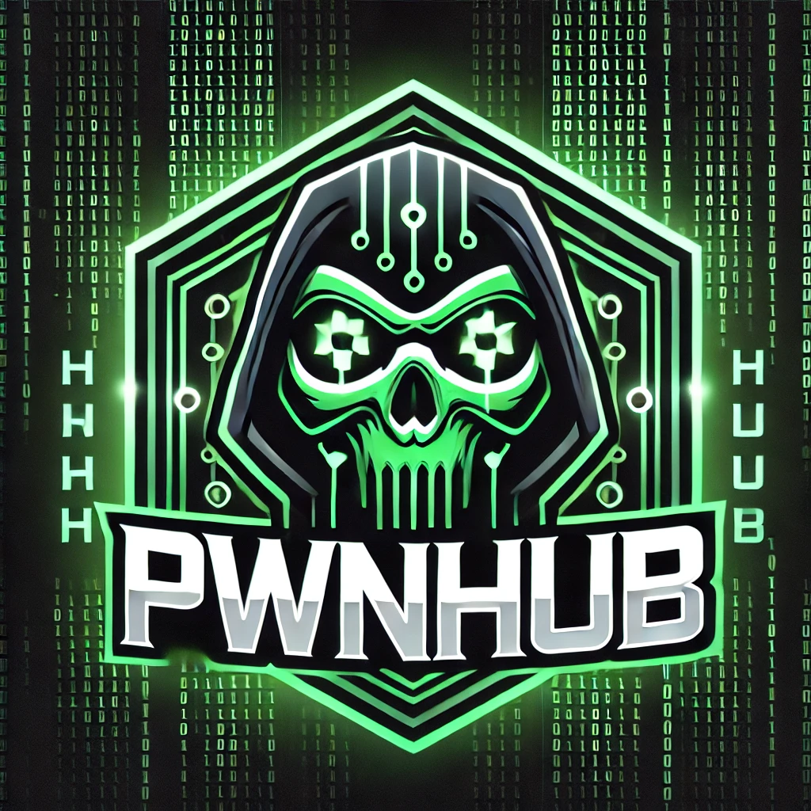

# PwnHub - Your Ultimate Hacking Resource

Welcome to **PwnHub**, a dedicated repository for ethical hackers, penetration testers, and security researchers. This repository serves as a central hub for various hacking-related resources, including scripts, exploits, books, and more.

## 📌 About
PwnHub is designed to be a **one-stop resource** for everything hacking-related. Whether you're looking for **automation scripts, privilege escalation techniques, exploit development, or cybersecurity books**, you'll find valuable content here.

## 🚀 Features
✅ **Custom Scripts** - Automation for enumeration, privilege escalation, network scanning, and more. 
✅ **Exploit Collection** - A growing list of exploits, including 0-days and proof-of-concepts. 
✅ **Cybersecurity Books** - Essential reading materials to enhance your hacking skills. 
✅ **Toolkits & Utilities** - Pre-configured tools to aid penetration testing. 
✅ **Writeups & Research** - Documentation of techniques, methodologies, and vulnerabilities. 

## 📜 Disclaimer
This repository is intended for **educational and ethical** purposes only. Unauthorized use of these materials for illegal activities is strictly prohibited. The repository owner is **not responsible** for any misuse.

## 🤝 Contributing
Want to contribute? Fork the repo, make your changes, and submit a pull request!

## 📬 Contact
For any inquiries, collaborations, or discussions, feel free to reach out:

🌐 Website: [jusot99](https://jusot99.github.io)

---

⚡ **Stay curious, stay ethical, and keep pwning!**

